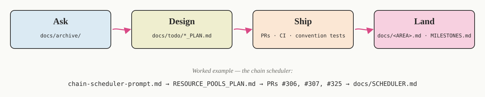

#  Cecelia Feijoa

[](https://github.com/schienstockd/cecelia/actions/workflows/ci.yml)
[](https://github.com/schienstockd/cecelia/actions/workflows/release.yml)
[](LICENSE)

A Julia package with a graphical interface for cellular image cytometry — import, segmentation,
tracking, gating, behavioural analysis, and clustering of multiplexed and live-cell microscopy
data. It is a ground-up reimplementation of the original R/Shiny
[cecelia](https://github.com/schienstockd/cecelia-legacy) in a Julia + Python + Vue stack.

> **This software was written almost entirely by AI.** Cecelia Feijoa's code was written by
> [Claude Code](https://claude.com/claude-code) under Dominik's direction, and validated on real
> intravital microscopy data. It has not yet been independently tested by other users. How the
> workflow works, per-subsystem validation, and sources:
> [How this software was built](#how-this-software-was-built).

- **Developer setup:** [`docs/INSTALL.md`](docs/INSTALL.md) · **Architecture:** [`docs/ARCHITECTURE.md`](docs/ARCHITECTURE.md) · **FAQ (why it's built this way):** [`FAQ.md`](FAQ.md)

---

## What Cecelia does

<p align="center"></p>

One browser window, one Julia backend, one Pixi-managed Python env. Every stage of the pipeline —
import, correction, segmentation, tracking, gating, clustering, quantification, analysis — writes
artifacts the viewer displays; a **chain** runs the stages you pick, per image, in parallel. The
old two-app (napari + Shiny) arrangement is gone.

---

## Install & run

The installer sets up [Pixi](https://pixi.sh) + [Julia](https://julialang.org) if missing, fetches
the latest release, and provisions the environment (a few GB on first run; later launches are fast).
Bioformats2raw and the Cellpose checkpoints download on first launch. Installs **just for you** by
default — no admin rights needed.

| OS | Install — in a terminal | Run |
|---|---|---|
| Linux · macOS | `curl -LsSf https://raw.githubusercontent.com/schienstockd/cecelia/main/install.sh \| sh` | Launch **Cecelia** from your applications menu |
| Windows | `irm https://raw.githubusercontent.com/schienstockd/cecelia/main/install.ps1 \| iex` (PowerShell) | Launch **Cecelia** from the Start Menu |

**First launch.** Cecelia opens in your browser at <http://localhost:8080>. A one-screen wizard asks
where to store your projects — accept the default or pick a folder. The choice is saved to
`~/.cecelia/custom.toml` (`%USERPROFILE%\.cecelia\custom.toml` on Windows); to move the folder later,
edit that file or delete it and relaunch.

**Advanced setup** — shared/lab machines (system-wide install), custom install location,
remote-server access — is in [`docs/INSTALL.md`](docs/INSTALL.md). To use your own
`bioformats2raw` instead of the bundled one, add `bioformats2raw = "/path/to/bioformats2raw"` under
`[dirs]` in `~/.cecelia/custom.toml`; every setting is listed in the bundled `app/config.toml`.

---

## Updating

Re-run the install command, run `pixi run update` from the install directory, or use the in-app
**Update** button. System-wide installs update by re-running the installer as an administrator.

---

## Bleeding-edge builds (dev channel)

Set `CECELIA_CHANNEL=dev` to track `main` instead of the latest release; the frontend is built
locally, so **[Node.js](https://nodejs.org) (npm) ≥ 20** must be installed. Re-run the same command
to update.

```sh
# Linux / macOS
curl -LsSf https://raw.githubusercontent.com/schienstockd/cecelia/main/install.sh | CECELIA_CHANNEL=dev sh
# Windows PowerShell
$env:CECELIA_CHANNEL='dev'; irm https://raw.githubusercontent.com/schienstockd/cecelia/main/install.ps1 | iex
```

---

## Monitoring tasks (terminal console)

Long jobs — segmentation, tracking, chain runs — go through a background scheduler. A read-only
terminal dashboard shows what's running, queued and finished, per-task elapsed, and per-pool
concurrency (cpu/gpu/io/network). Run alongside the app, from the install directory:

```sh
# Linux / macOS
cd ~/.local/share/cecelia && pixi run console
# Windows
cd $env:LOCALAPPDATA\cecelia ; pixi run console
```

Add `-- --stream` for an append-only log (`pixi run console -- --stream | tee run.log`). `Ctrl-C`
closes it — your tasks keep running.

---

## Adding your own analysis step

Cecelia is extensible without touching the package or rebuilding. Drop two files into your config
directory — a JSON describing the form, a Julia file saying what happens on Run — and your task
appears on the page you named. Package the same files as a **plugin** and you get a page of your
own; plugins install from a URL in **Settings → Plugins**.

Guide: [`docs/CUSTOM_MODULES.md`](docs/CUSTOM_MODULES.md). Two runnable examples ship in the repo
(loaded by CI on every commit): [`docs/examples/custom-modules/`](docs/examples/custom-modules/) and
[`docs/examples/plugins/`](docs/examples/plugins/).

> Neither is sandboxed — a custom module is arbitrary code with full access to your machine, exactly
> like an R package. Only run what you wrote or trust.

---

## Developing

Running from source with hot-reload (`pixi run dev`) is covered in [`docs/DEV.md`](docs/DEV.md).

---

## How this software was built

<p align="center">.md · MILESTONES.md); worked example on the chain scheduler" width="100%"></p>

This software was developed almost entirely with [Claude Code](https://claude.com/claude-code)
(Anthropic), using the Claude Opus and Claude Sonnet models, under the Garvan Institute of Medical
Research enterprise license. The field hasn't settled on how to develop, disclose, credit, or
validate AI-assisted scientific software — this section is what we did. Longer version in
[`docs/PROVENANCE.md`](docs/PROVENANCE.md).

**Claude's role.** Claude wrote essentially all of the code — both the port of the original R/Shiny
`cecelia` and the newer subsystems that have no direct predecessor (the WebGPU browser viewer, the
offline renderer, the analysis board, the notebook playground, the chain executor). On engineering
decisions it was consulted like a colleague with opinions worth listening to; on scientific
decisions it was the implementer, not the judge.

**The human role — direction, and validation on real data.** Dominik set every goal and every
design decision, and provided the immunology and intravital-microscopy judgment the analysis has to
be correct for. The automated test suite checks *code correctness* — that a function does what it's
supposed to. It doesn't check *scientific correctness* — whether a segmentation captured the cells
that mattered. Early in the port, a segmentation model was being tuned by an accuracy metric
computed without ground truth; on those numbers temporal smoothing looked unhelpful, and the AI
proposed dropping it. On real intravital output, temporal smoothing was in fact what captured the
cells being analysed — the metric had been optimising something other than the biological signal.
The final choice was made on the images, not on the number. Per-subsystem validation record:
[`docs/PROVENANCE.md`](docs/PROVENANCE.md).

**Attribution.** Claude wrote the code. Dominik directed it, reviewed as much as was practical, and
made every scientific and design decision. Neither is the sole author in the sense the word meant a
few years ago. Every public disclosure the field has landed on so far agrees on one thing: AI isn't
a listed author. On everything else — how loudly to say "AI wrote this", what to call the human's
role, where maintenance responsibility sits — there isn't a convention yet. This section doesn't
try to invent one.

### Sources

- The original **`cecelia`** R/Shiny package by Dominik and colleagues — the behavioural
  specification this project ports. Published in *Nature Communications* (2025),
  [doi:10.1038/s41467-025-57193-y](https://doi.org/10.1038/s41467-025-57193-y); source (R version):
  [github.com/schienstockd/cecelia-legacy](https://github.com/schienstockd/cecelia-legacy).
- The scientific tools this pipeline orchestrates, each retaining its own license and citation:
  **Cellpose** (segmentation), **btrack** (Bayesian cell tracking), **scanpy** / **anndata**
  (single-cell data + clustering), **scikit-image**, **PyTorch**.
- The **celltrackR** R package (Wortel & Textor) — its track-measurement algorithms are ported in
  `app/src/tasks/tracking/track_measures.jl`. Cited work, not just a dependency: Wortel et al.
  (2021), *Cell Reports Methods*, [doi:10.1016/j.crmeth.2021.100006](https://doi.org/10.1016/j.crmeth.2021.100006).
- The **Julia**, **Python**, and **Vue** (with PrimeVue and Observable Plot) open-source ecosystems.

---

## License

Cecelia Feijoa is licensed under **GPL-3.0-or-later** — see [`LICENSE`](LICENSE). This is
inherited from the original `cecelia` R package (`GPL (>= 3)`) that this project ports.

Third-party software it derives from, bundles, or depends on — including **celltrackR** (GPL-2.0),
whose track-measure algorithms are reimplemented in `app/src/tasks/tracking/track_measures.jl` — is
acknowledged in [`THIRD_PARTY.md`](THIRD_PARTY.md).
