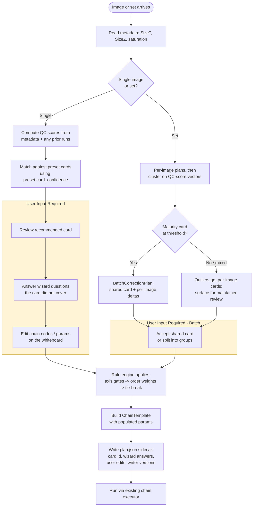

# Correction plan + QC — metadata-driven decision tree

**Status:** **in-progress** (2026-09-06). Phases A–E shipped: Q-M4 sparsity probes (PR #811),
§2.1 metadata-derived score layer (PR #813), §1 rule table + §3 tie-break + §5 seed cards
(PR #815), plan.json persistence + provenance (PR #819), chain mount + card recommender (PR #821 —
`plan_to_chain_template` yields a `ChainTemplate` the executor accepts; `recommend_card(scores,
wizard)` auto-picks a card so `recommend_plan` can leave `card_id` implicit), UI slice **3a**
(PR #824 — `GET /api/correction-plan/presets` + `POST /api/correction-plan/recommend` and a
read-only `CorrectionPlanPanel` above the TaskRunner in the cleanup module: card name, included
steps with `orderWeight`/`source`, excluded rows with their `exclusionReason`, QC scores collapsed,
for one selected image), the **C-Deep3D card update** for PR #818 (PR #825 — `driftPerPlane = true`
+ `driftZSmoothness = 0.0` alongside stackAlign, per the peer session's "they compose" finding:
stackAlign = intra-stack per-frame anchor; driftPerPlane = inter-frame per-Z-plane rigid, different
axes, no double-count), and — on this branch — UI slice **3b** (card picker + save/load): the panel
now offers a `ChipSelect` of the five cards, picking one calls `POST /api/correction-plan/save`
which computes + persists `plan.json` in one round-trip; `GET /api/correction-plan/get` is the
load-first entrypoint that also returns `stale: true` when the saved fingerprint no longer matches
the image's meta (a re-import happened), UI slice **3d** (mount-to-chain, PR #831): `POST /api/correction-plan/mount`
reads the saved plan, converts it via `plan_to_chain_template`, and writes a `ChainTemplate` under the
project's chains dir as `correction-plan-{imageUid}` (canonical per-image); the panel adds a
"Mount to chain" button that is disabled until a plan is saved, and a 409-on-conflict + inline
Replace/Cancel guard so re-mounting never silently clobbers a hand-edited chain — and, on this branch,
UI slice **3c** (wizard W2/W3/W5): a `CollapsibleSection` under the card row exposes the three enum
questions from §4 that overlay a card independently (W2 stage rotated → `sitkRigid`; W3 frame-to-frame
warp → include `flowRegister`; W5 intra-stack Z drift → include `stackAlign`); an answer immediately
re-saves the plan via the same `/save` endpoint the card picker uses. W1 is intentionally omitted (the
card picker IS W1); W4 (per-channel afCombinations) and W6 (cpCorrected trust/exclude) are retired 2026-09-06 (W4 is already exposed as the per-combination `exclusive: bool` field on `af_correct.json`; W6 is a retired writer, project switched to SUPPORT), earlier believed conditional
and deferred to a follow-up. The §8 provenance triple was reduced to a doubleton after review:
`writer_versions` per step doesn't apply (cecelia ships as one package — a single `ceceliaVersion`
covers cache invalidation); `upstream_value_names` per step stays deferred (the chain executor's own
`execute_task` wiring knows which `value_name` each node reads — no second source of truth needed
until a UI wants it without loading chain state). Q-C1 resolved by PR #810 (afDriftCorrect composite
retired); Q-C10 no longer applies. Q-C3, Q-C6/C7, Q-C4, Q-C8 resolved 2026-09-06 (this branch) —
default drift normalisation stays `none`; smooth = bucket 300 (before AF) per SMOOTHING_PLAN's
measured evidence, no composite; AF ceiling is no longer a cohort metric; default `meta.saturation`
is the honest signal for denoise since saturation is an acquisition property. **What's left:** the
remaining §Open questions (non-blocking / prompt confirmations only). UI is complete: W1 = the card
picker, W2/W3/W5 = the wizard section, W4/W6 retired as unnecessary.
**Origin:** [`docs/archive/correction-qc-audit-prompt.md`](../archive/correction-qc-audit-prompt.md).
Grounded in the three-part audit produced alongside this plan:
[`docs/archive/audit_phase1a_catalog.md`](../archive/audit_phase1a_catalog.md) (catalog),
[`docs/archive/audit_phase1b_history.md`](../archive/audit_phase1b_history.md) (decisions + evidence),
[`docs/archive/audit_phase1cd_qc_and_provenance.md`](../archive/audit_phase1cd_qc_and_provenance.md)
(QC signal + provenance).

## What this plan proposes

A **single per-image `CorrectionPlan`** — an ordered sequence of `cleanupImages.*` tasks with
already-populated params — recommended from (a) whatever acquisition metadata cecelia currently reads,
(b) computed QC scores from the pixels, and (c) a small set of named **acquisition preset cards** the
user can pick from and edit. The engine that turns a plan into a run is the existing chain executor
(`app/src/tasks/chain.jl`) — a `CorrectionPlan` is a **named `ChainTemplate` preset** with
provenance, not a parallel data model.

The plan surface answers three questions in one place:
1. *Which corrections apply to this image, and in what order?*
2. *For each correction, what is a reasonable starting param set?*
3. *Where are the answers just user knowledge, and where can we compute them?*

None of the audit's contradictions (C1–C10) are silently resolved here. Every open question is
punted, cited, and enumerated at the bottom of the doc under **Open questions** — a Phase 2
implementation depends on the maintainer picking a side.

## Non-goals

- **No changes to any existing correction task.** Every function in the catalog (§1a) stays as it is.
- **No new correction task.** The plan orchestrates what exists.
- **No runtime enforcement of "correct" order.** The plan proposes an order and lets the user override
  per-node (same freedom the chain whiteboard already has).
- **No wizard-only surface.** The wizard is a fallback for the "not derivable" preconditions from 1c,
  never a substitute for the direct chain editor.
- **No new metadata field is invented and then assumed to exist.** Every "would-need-metadata" signal
  gap from 1c is called out explicitly and either (a) becomes a wizard question, or (b) is left
  unfilled with a placeholder default.

---

## 1. Rule table

One row per correction from [`audit_phase1a_catalog.md`](../archive/audit_phase1a_catalog.md). Every
task in the catalog appears, per the discovery-first + "never silently drop a task" constraints.

Columns:

- **Trigger** — the condition(s) under which the plan includes this task.
- **Action** — `include` (add to plan), `require` (add and mark non-removable), `exclude` (drop from
  plan), `user-pick` (offer, but decide by user choice/card).
- **Order weight** — an integer bucket the plan sorts by. Ties broken by user chain edits. Small
  weight = earlier. Buckets: 100 pre-drift geometry, 200 drift, 300 post-drift residuals, 400
  intensity/signal, 500 storage/output. Weights below are per-audit-quote — every contested one
  points at the open questions section.
- **Exclusion reason** — human-readable string surfaced in the plan UI so the audit trail records
  *why* a task was skipped.

| Correction | Trigger | Action | Order weight | Exclusion reason (human) |
|---|---|---|---|---|
| `cleanupImages.stackAlign` | Image has a `Z` axis AND user chose a preset that says "breathing / intra-stack Z offset likely" (no metadata field exists — see §Q-M3) | `user-pick` (default off for a card that does not say so) | **100** — before `driftCorrect` per PR #793 / STACK_ALIGN_PLAN L14 (**OPEN — see §Q-C1**: PR #798/#802 restate order as `driftCorrect` first) | "No Z axis" / "Card does not indicate intra-stack breathing" |
| `cleanupImages.driftCorrect` (any estimator) | Image has a `T` axis (structural, `requires.axes: ["T"]`) | `include` if `T` present | **200** | "No T axis — drift correction not applicable" (`TaskApplicabilityError` today) |
| `cleanupImages.driftCorrect` — `driftEstimator = sitkRigid` | User pick from wizard/card; NEVER auto-promoted per 1b Rule 2 / PR #785 D2 | `user-pick` (default `multiLag`) | (same bucket 200) | "Default `multiLag`; opt into rigid only for known stage rotation" |
| `cleanupImages.driftCorrect` — `driftNormalisation` | Resolved §Q-C3 — default stays `none`; per-image tunable, not a card commitment | `user-pick` (default `none`) | (same bucket 200) | Q-C3 resolved 2026-09-06 |
| `cleanupImages.flowRegister` | User pick — no cheap plan-time probe; JSON has no `requires.axes` even though it needs `T` (1a inferred assumption 6) | `user-pick` (default off) | **300** — post-drift, per PR #798 | "Card does not indicate intra-frame non-rigid deformation" |
| `cleanupImages.afCorrect` | User declared `afCombinations` OR card documents an AF-affected specimen (still user-pick — the combinations are a specimen question, PR #559 / §Q-M5 filter fingerprint) | `user-pick` (default off) | **400** — after drift AND after smooth (Q-C6/C7 resolved 2026-09-06: smooth before AF, no composite) | "No `afCombinations` declared" / "Card lists no AF interactions" |
| `cleanupImages.afDriftCorrect` (composite) | User picks the composite instead of the two tasks separately | `user-pick` (default on when both `afCorrect` and `driftCorrect` are in the plan) | **400** (its `afCorrect` step); composite writes `driftCorrected` as its final `outputValueName` | See §Q-C10 — composite writes intermediates that `funParamsByName` cannot distinguish per-step |
| `cleanupImages.smooth` (spatial) | Photon-limited channel(s) present. **No plan-time probe today** (1c §gap 4). Preferred trigger = card "resonance / photon-limited" per 1b Rule 1. Fallback = post-hoc `zeroFracIn > 0.15` from a prior run | `user-pick` (default on for the photon-limited card, off otherwise) | **300** — before AF (Q-C6/C7 resolved 2026-09-06 per SMOOTHING_PLAN's measured evidence on `zolIMa/fXgbTl`) | "Card is not photon-limited" / "No prior `zeroFracIn` above 0.05 for any selected channel" |
| `cleanupImages.smooth` (temporal) | Spatial trigger fires AND image has `T` axis AND upstream is drift-corrected (name heuristic — 1a inferred assumption 6, **OPEN §Q-C1**) | `user-pick` (default `median`) | (same bucket as spatial smooth) | "No T axis" / "Card excludes temporal averaging" |
| `cleanupImages.denoise` (SUPPORT) | Seeded by the C-Resonance card. Two gates chain in order: (1) `denoise.vault_model_present` — vault holds at least one trained SUPPORT model (2) `denoise.channel_saturated_frac < 1.0` — at least one selected channel is NOT saturated (per PR #796 / DENOISE_INTEGRATION_PLAN D6). Not seeded by other cards; `SizeT ≥ inputFrames` remains task-level (PR #805) | `card`-seeded on C-Resonance, `user-pick` elsewhere | **400** — after drift correction per JSON tip; before/after smooth is **OPEN §Q-C6/C7** | "No trained denoise model in vault" / "All selected channels saturated (`meta.saturation`)" / "SizeT too short for model inputFrames" (task-time) |
| `cleanupImages.cellposeCorrect` (RETIRED) | Never included by the plan — `RETIRED_FUN_NAMES` errors on re-run | `exclude` (hard) | — | "Retired with cellpose v4 migration (#610). Use `cleanupImages.smooth` for photon-limited data or `cleanupImages.denoise` for SUPPORT denoising." |

**Moved out of scope 2026-09-08:** `dtype` and `flip` were relocated to `editImages/` (Preprocessing
module). They are user-storage / user-geometry choices, not corrections — the planner should not
recommend or exclude them. See PR moving `cleanupImages.{dtype,flip}` → `editImages.{dtype,flip}`.

### Notes on the table

- **Every "auto-detect" cell is `include` only for the two rules that have a real metadata field**:
  the `T`/`Z` axis gates and the denoise saturation gate. All other rules are `user-pick` because
  their preconditions live in cards or in the wizard (per 1c: only 2 auto rules, 0 pre-run pixel
  probes, 5 post-hoc reliability metrics, 1 canonical "not derivable").
- **Order weights** encode the pipeline order in a small, tunable set of buckets rather than as a
  total ordering. A `ChainTemplate` built from the plan sorts by weight; ties are laid out in the
  order tasks were added and are user-editable.
- **Legacy retired-writer stores** (`cpCorrected`) are not migrated per 1b Rule 7. The plan cannot
  recommend re-running a retired task. If an image's `_active` version is `cpCorrected`, the plan
  surfaces a warning row (see the wizard §4 question W4) but does not attempt to rebuild the store.

---

## 2. QC scoring, not hard thresholds

Every QC metric produces a **continuous `score ∈ [0.0, 1.0]`** (higher = more confidence that the
condition holds), and rules trigger on score ranges. Bands are defensible only as **"calibrated on
Dominik's dev movies"** per 1d ground-truth (there is none), so every band below is explicitly
flagged as a placeholder.

Notation: a range `x ≥ 0.7 → include` means the plan includes the task when the score is at least
0.7. The maintainer can retune ranges without touching the rule table.

### 2.1 Scores derived from metadata (no pixel work at plan time)

| Metric | Signal source | Score formula (draft) | Trigger ranges (**placeholder**) | Ground-truth status |
|---|---|---|---|---|
| `axis.T_present` | `meta.SizeT > 1` (structural) | `1.0` if `SizeT > 1`, else `0.0` | `≥ 0.5 → include driftCorrect / temporal-smooth / denoise-T` | Structural, no calibration needed |
| `axis.Z_present` | `meta.SizeZ > 1` | `1.0` if `SizeZ > 1`, else `0.0` | `≥ 0.5 → include stackAlign` | Structural |
| `denoise.channel_saturated_frac` | `meta.saturation.channels[i].saturated` per selected channel (structural pile-up per `saturation_run.py`) | `sum(saturated) / len(selected_channels)` | `= 1.0 → exclude denoise (all-saturated refusal, PR #796)`; `> 0.0 → warn` | Structural detector (**C9** — the plan-doc-vs-code discrepancy on `dtype_max * 0.98` is unresolved) |
| `denoise.trainable_length` | `meta.SizeT` vs model manifest `inputFrames` | `1.0` if `SizeT ≥ inputFrames`, else `0.0` | `= 0.0 → exclude denoise-train (PR #805)` | Structural |
| `preset.card_confidence` | Match score between (metadata fields + already-computed QC scores) and each card's declared parameter set (see §5) | Cosine similarity over the joint feature vector, in `[0, 1]` | `≥ 0.7 → recommend that card`; `[0.4, 0.7) → offer as a runner-up`; `< 0.4 → offer the "custom / no preset" card` | Placeholder — no ground-truth card-classifier |

### 2.2 Scores computed from pixels (post-hoc reliability, not plan-time preconditions)

These are already banked by tasks that ran; the plan reads them from `qc/{fun}/{value_name}.json`
(one entry per run). They **cannot** trigger a first-run plan — only re-plans / re-runs. This
limitation is intrinsic to the audit finding "no plan-time pixel probe exists" (1c §gap 2).

| Metric | Task that writes it | Score formula (draft) | Trigger ranges (**placeholder**) | Notes |
|---|---|---|---|---|
| `drift.residual_rms` | `drift_correct` (PCC estimators only — **estimator-conditional**, 1a inferred 4) | `clamp(1 - residualRms / 2.0, 0, 1)` — 2 px is the calibrated `residualRms` warn threshold (`drift_correct.jl:12`, PR #524) | `< 0.0 (≥ 2 px) → warn re-run with a different reference channel or estimator` | Absent on `sitkRigid`-only sidecars — score = `NaN`, plan treats as "no signal" not "good signal" |
| `drift.jitter_transitions` | `drift_correct` (jitter smoother, `DRIFT_JITTER_PLAN`) | `clamp(1 - transitions / 100, 0, 1)` — `2h06xA` went 107 → 11 after σ=6 smoothing per DRIFT_JITTER_PLAN | `< 0.5 → recommend raising `driftSmoothSigma`` | Post-hoc |
| `stackalign.applied_fraction` | `stack_align` (`nPlanesApplied / nPlanesTotal`) | Direct — the fraction itself | `< 0.35 → warn (per `STACK_ALIGN_APPLIED_FRAC_WARN`)`; `< 0.1 → recommend excluding stackAlign next run` | Post-hoc |
| `flowregister.high_shifts` | `flow_register` (fraction of frames with peak ≥ 85% of `maxShiftPx`) | `clamp(1 - high_shift_frac / 0.5, 0, 1)` — 50% of frames hitting the clamp is the shipped warn | `< 0.5 → warn "raise maxShiftPx or accept deformation is beyond dense flow"` | Post-hoc |
| `smooth.photon_limited_frac` | `smooth` (`zeroFracIn` per channel, worst over selected channels) | Direct — the max `zeroFracIn` | `≥ 0.15 → recommend `smooth` on next-run plans for the same set (per 8.5% vs 15.4% measurement in 1a's `smooth.jl` handler note)` | **Confounded by drift-canvas padding — per `_smooth_metrics` docstring**. Do not treat as image-invariant; use only within a set of drift-corrected inputs |
| `af.bleedthrough_alpha_max` | `af_correct` (per-pair α; worst over pairs) | `clamp(alpha_max / AF_ALPHA_MIN, 0, 1)` gate above `AF_ALPHA_MIN`, else `1 - alpha_max` | `≥ 0.5 → keep bleedthrough sub-step on for the same pair on next plan` | Post-hoc; `exclusive` flag remains a user pick |
| `af.saturated_frac` | `af_correct` (`saturatedFrac` per channel, worst over selected) | `1 - worst.saturated / 0.001` clamped | `≤ 0 → warn saturated input; no correction recovers clipped voxels` (1a) | Not the same as denoise's `meta.saturation` gate — see **C8**; the two numbers can disagree |

### 2.3 Cohort scores (across a set)

Batch mode (§6) reads set-scope cohort metrics that are already banked by
`qc_cohort.jl` — `afCorrect`'s `ceiling` is the worked example (1b commit `92295f35`, 1.71× range
across 9 identical-setting movies). Cohort scores tell the plan when one image is an outlier that
needs its own card. Full detail deferred to §6.

### 2.4 Every band is a placeholder

Per 1d §4 there is no reference dataset. Any threshold committed here needs the maintainer's OK
before it becomes a shipped default. The plan design is that ranges are stored in a single
config file (`config/qc_score_bands.jl`, to be created), not sprinkled through the rule engine —
one place to tune.

---

## 3. Tie-break policy

When two rules produce contradictory actions on the same task for the same image, the plan resolves
in this order (highest wins):

1. **Explicit user chain edit** — a chain node the user has added or removed by hand.
2. **Wizard answer** (§4) — a direct answer the user gave for this image.
3. **Preset card assignment** (§5) — the card the user picked or accepted as recommended.
4. **Computed QC score** in its trigger range (§2.1 / §2.2).
5. **Rule-table default** (§1).

### Worked examples per contradiction type

- **User chain edit vs preset card.** Card "resonance / photon-limited" says include `smooth`
  (§5 C-Resonance). User removes the `smooth` node from the chain whiteboard. **User wins.** Plan
  records `edited_by_user: true` on the node so the removal is not re-applied when the card is
  re-evaluated.
- **Wizard answer vs computed QC.** Wizard question W2 ("Was the stage bumped during acquisition?")
  = "yes" → plan sets `driftEstimator = sitkRigid`. Computed `drift.residual_rms = 1.2 px` from a
  prior `multiLag` run says "reliability is fine". **Wizard wins** (specimen question, per PR #785
  D2 "never quietly promote it").
- **Card vs computed QC.** Card "galvo / clean signal" (§5 C-Galvo) sets `smooth = off`. A prior
  `smooth` run banked `zeroFracIn = 0.22` on a channel — the metric says photon-limited. **Card
  wins** because the metric is post-hoc and the maintainer picked the card knowing the acquisition
  regime. The plan surfaces a warning: "prior run banked `zeroFracIn = 0.22` on ch2 — override this
  card if the channel is actually photon-limited". Nothing changes silently.
- **Rule-table default vs computed QC.** No card, no wizard answer. Rule-table default for
  `stackAlign` is "off". A prior `stack_align` run banked `applied_fraction = 0.9`, well above the
  0.35 warn. **QC score wins** and the plan flips `stackAlign` on for a re-plan.

### Non-goal for the tie-break

The engine does **not** attempt to resolve C1 (pipeline order between PR #793 and PR #798/#802) or
C6/C7 (`smoothAfDriftCorrect` composite existence and its order) from data. Those are prose
contradictions in PR bodies; the tie-break policy applies within one image, not across the
maintainer's own history. See §Open questions.

---

## 4. Wizard question set

**Wizard fires only for the "not derivable" preconditions from 1c** (1 canonical + a handful the
plan cannot know without asking). Each question is minimal: bool or a short enum, one per line, no
dependent questions in the initial pass. Answers persist on the image's `plan.json` sidecar (§8) so
the wizard is answered once per image and re-used on re-plans.

The wizard is a **fallback**, not the primary surface. A user who picked a preset card that already
answers a question does not see it. A user who wants to skip the wizard entirely picks the "custom"
card and edits the chain directly.

| # | Wording (draft) | Answer type | Feeds |
|---|---|---|---|
| **W1** | "What kind of scanner produced this movie?" | Enum `{resonance, galvo, spinning_disk, widefield, other/unknown}` | Card recommendation (§5); `smooth` prerequisite for AF (1b Rule 1) |
| **W2** | "Was the stage rotated or bumped during acquisition?" | Enum `{no (translation only), yes (rotation), unknown}` | `driftCorrect.driftEstimator = sitkRigid` when `yes` (1b Rule 2 / PR #785 D2) |
| **W3** | "During this movie, did the sample deform between frames beyond a simple shift? (e.g. resonant-scan flexing, respiration warp)" | Enum `{no, yes, unknown}` | `flowRegister` include when `yes` (1c gap 2 — no metadata field) |
| ~~**W4**~~ | ~~per-channel `afCombinations[i].exclusive`~~ | ~~Per-channel bool~~ | **RETIRED 2026-09-06** — the specimen question is already exposed as the per-combination `exclusive: bool` field in `af_correct.json` (label "Different cell types", tip "Turn off if cells can carry both markers"). The user answers it right where they declare the combination; a plan wizard entry would duplicate the task-param widget. |
| **W5** | "Is any Z-plane offset from its neighbours because the sample moved during Z acquisition (breathing, drift within a stack)?" | Enum `{no, yes, unknown}` | `stackAlign` include when `yes` (1c gap 3 — no `meta.breathing`) |
| ~~**W6**~~ | ~~`cellposeCorrect` retired-store trust/exclude~~ | ~~Enum `{trust, exclude}`~~ | **RETIRED 2026-09-06** — `cellposeCorrect` is a retired writer; the project has switched to SUPPORT for denoise. No `cpCorrected` stores get created going forward, so the wizard has nothing to gate on. Q-P3 closes with the same reasoning. |

### Why the wizard is small

Every question either (a) is a documented "not derivable" precondition from 1c, or (b) fills a
signal gap that has no metadata field and no cheap pixel probe (1c §gaps 1–3). The plan does not
ask any question a preset card can answer implicitly. Photon-limited-ness is not a wizard question:
it is a computed post-hoc metric (`zeroFracIn`) OR a consequence of the card the user picks (W1 =
`resonance`).

### What the wizard deliberately does not ask

- Reference channel for drift/stack-align/flow-register: this is a shipped param on each task; the
  plan pre-populates from an existing card default (§5) but never overrides the user's manual pick.
- `driftMaxLag` / `driftSmoothSigma` / `maxShiftPx`: task-level tuning parameters, exposed on the
  chain whiteboard, not the plan surface.
- `denoise` model choice: a vault picker on the denoise node, not a plan question.

---

## 5. Preset acquisition cards

**Cards are named presets over the SAME parameter set the wizard populates and the chain executor
runs.** No parallel data model, per the prompt's constraint. Each card is one row in a static
registry (`app/src/tasks/correction_presets.jl`, to be created) mapping a card id → a
`Dict{fun_name, params}` bag + a `Vector{fun_name}` ordering.

### Card seed set (5)

Seeded from what the codebase actually documents. Every card marks each parameter it sets as either
a **hard commitment** (the card is defined by this value; changing it should re-classify the image
to a different card) or a **starting point** (the user is expected to edit).

| Card id | Name | One-line description | Recommended by (metadata + QC signals) | Parameter set (hard commitments in **bold**, starting points in italics) |
|---|---|---|---|---|
| `C-Resonance` | Resonance / photon-limited | Fast dwell, single-digit photon counts per pixel, needs smoothing before AF | W1 = `resonance` OR `preset.card_confidence` matches on prior `zeroFracIn ≥ 0.15` (per 1b Rule 1 / SMOOTHING_PLAN L111 / commit `95894bed`) | **`smooth` on, `spatialMethod = bilateral_vst`** (per PR #777); *`temporalStat = median`*, *`temporalFrames = 3`* (per SMOOTHING_PLAN median-for-time rule, commit `95cb553f`); **`smooth` sits before AF** (Q-C6/C7 resolved 2026-09-06); `driftEstimator = multiLag`; `denoise` off unless a resonance-trained SUPPORT model exists AND per-channel saturation is 0 |
| `C-Galvo` | Galvo / clean signal | High-SNR, gaussian smoothing optional, AF via straightforward triangle background | W1 = `galvo` AND no prior `zeroFracIn ≥ 0.05` | `smooth` off; *`spatialMethod = gaussian`* if smooth is turned on later; `driftEstimator = multiLag`; **`afCorrect` on if `afCombinations` declared**; `denoise` user-pick |
| `C-SpinningDisk` | Spinning-disk / live-cell / fast timelapse | Short frames, translation-only drift, minimal spatial noise, temporal median often over-smooths cell motion | W1 = `spinning_disk` | `smooth` off by default (**temporalMean inflates masks ~34%** per commit `95cb553f`); `driftEstimator = multiLag`; `flowRegister` off (rigid enough); `stackAlign` off (usually 2D); `denoise` user-pick |
| `C-Deep3D` | Deep 3D / breathing-affected | Z-stacks with intra-stack offset AND depth-dependent inter-frame motion; stackAlign composes with `driftCorrect(driftPerPlane)` per the "they compose" finding | W1 = any AND W5 = `yes` OR `stackalign.applied_fraction ≥ 0.5` on a prior run | **`stackAlign` on** (`STACK_ALIGN_PLAN` L14, PR #793); *`alignReference = middle`*; *`minConfidence = 0.35`* (`STACK_ALIGN_APPLIED_FRAC_WARN`); `driftEstimator = multiLag`; **`driftPerPlane = true`** (PR #818 breathing-shear case — the reason this card exists); *`driftZSmoothness = 0.0`* (starting point; raise per `drift_correct.json` tip if planes still jump); `flowRegister` off |
| `C-Custom` | Custom / no preset | Empty plan; user builds a chain by hand | Fallback when `preset.card_confidence < 0.4` for every other card | Only structural rules (`T`/`Z` gates); everything else user-pick |

### Card semantics

- **Cards do not encode pipeline order.** The order is the rule-table `order weight` (§1). A card
  can add or remove tasks, and can set params on them, but the sequence comes from the buckets.
  When §Q-C1 is resolved the buckets change; the cards do not.
- **A card is a starting point, not a lock-in.** The user can accept the recommended card, pick a
  different one, or accept-then-edit any parameter. The `plan.json` sidecar records the picked card
  id AND the user's per-task edits, so the delta from the card is legible.
- **"Recommended" ≠ "auto-run".** A recommendation surfaces a card; the user still confirms before
  the plan lands on the chain whiteboard.

### Cards + ground truth (the honest bit)

Per 1d §4, cecelia has no verified-acquisition-property fixtures. The seed cards are named for
regimes documented in commit messages and plan docs, not for any measured card-classifier accuracy.
`preset.card_confidence` is defined but its threshold (§2.1) is a placeholder. Cards are a
usability layer; a first shipping version needs the maintainer to attest that at least one
representative image exists in `dev/` for each card, or the card is marked "unvalidated" in its
description string.

---

## 6. Bulk / batch parameter recommendation (design sketch, deferred)

**Phase 2.5. Design-only, not in scope for first implementation.** State up front so the batch
design does not gate on the per-image design.

### Sketch

For an experimental **set** (`CciaImageSet`, one entry per member):

1. **Per-image plan** — run the §1–§5 engine on every image in the set. Each image gets a card
   assignment and a chain template.
2. **Compute the set's card histogram.** If ≥ N% of images resolved to the same card, propose that
   card as the **shared preset** for the set. (Placeholder: N = 80%.)
3. **Cluster the images on their QC-score vectors.** The vector = the per-image scores from §2.
   Use a cheap 1D/2D method (k-medoids over cosine distance is enough; no need for scanpy). Images
   in the majority cluster → adopt the shared card as-is. Images in a **minority cluster** are
   flagged as outliers with a per-image card of their own.
4. **The shared plan is a `BatchCorrectionPlan`** — one card + one param delta + a
   `Vector{ImageUid}` of members + a `Vector{ImageUid}` of outliers each carrying their own plan
   pointer.
5. **Cohort-scope QC signals feed the outlier detection.** `qc_cohort.jl`'s existing outlier
   detection (`ceiling` for `afCorrect`, per 1b commit `92295f35`) is the model — a metric where
   one image's value is neither right nor wrong except relative to peers.
6. **Rollout.** Running a `BatchCorrectionPlan` builds one `ChainRun` per image using
   `ChainTemplate` = shared card's template with the image's own overrides applied.

### Why deferred

- The per-image design is the bar. The batch layer is a UI + a cheap clustering step on top.
- The `qc_cohort.jl` outlier-detection contract is not yet defined for the correction QC space; the
  per-image plan needs to ship first so cohort metrics have something to bank.
- Two open questions (Q-C1 pipeline order, Q-P1 corrected-store staleness) affect what a shared
  card means in practice.

---

## 7. Mermaid decision flow

The full rule table does not fit in a legible diagram, so the diagram encodes the **decision
categories** per the prompt's fallback rule. Full per-function detail lives in §1.

The diagram uses a `subgraph User_Input_Required` block for every step the user drives. Everything
else is automatic. The batch branch is drawn from the same starting node.



The `User Input Required` subgraphs are the visual distinction the prompt asks for: any node inside
a yellow-tinted subgraph is a decision the user drives. Everything outside is deterministic given
the same inputs.

---

## 8. Proposed Julia data structures

### Discovery-first result

Before proposing anything, checked (grep evidence in the audit fork's tool output):

- **`ChainTemplate` / `ChainRun` / `ChainNode` / `ChainEdge`** already exist in `app/src/tasks/chain.jl`
  (lines 19, 55, 60, 82). A per-image thread runs an ordered DAG of task nodes with populated params,
  barriers, resume, event pub/sub. **This is the substrate.** A `CorrectionPlan` is a
  `ChainTemplate` + provenance metadata, not a new executor.
- **`CompositeTask`** exists in `app/src/tasks/task.jl:1058` with JSON `composite: [...]` array
  ordering. This is the *only* place ordering is hard-coded today (per 1a). A `CorrectionPlan` is a
  more expressive substitute — the composite pattern stays for `afDriftCorrect` because it is a
  first-class user surface.
- **`TaskApplicabilityError`** exists in `app/src/tasks/task.jl:895`. Reused for `exclude` actions
  when the rule engine refuses a task on this image.
- **`qc_finding(level, code; key, subs...)`** exists in `app/src/qc.jl:263`; findings persist
  `key` + `subs` and render `short`/`long` from `QC_TEXT` on read. `write_qc(img, fun_name,
  value_name, findings; metrics = metrics)` at `qc.jl:318` is the write surface. **Reused.**
- **No existing type** matches `CorrectionPlan`, `QCResult`, `AcquisitionPreset`, or
  `CorrectionStep`. Nothing to reuse for those.

### Types (design sketch, no method bodies)

```julia
# app/src/tasks/correction_plan.jl (new)

"""
    QCResult(metric, score, level, subs, scope)

One QC signal, banked with a continuous score in `[0.0, 1.0]` alongside the
`qc_finding` catalog. `metric` is the score name (e.g. `"drift.residual_rms"`); `score`
is the normalised value used by the rule engine; `level` is the `qc_finding`
severity (`"info"` / `"warn"`); `subs` are the placeholder substitutions that
render `QC_TEXT[metric]` on read (same convention as `qc_finding`); `scope`
records whether the score is per-image, per-channel (i, c) tuple, per-pair
(c_target, c_source), per-frame (t), or per-plane (t, z), so a Phase 2
consumer can reduce correctly across scopes (per 1d §3, no current precedent
addresses per-channel vs per-pair composition).
"""
struct QCResult
    metric::String
    score::Float64
    level::String
    subs::Dict{Symbol, Any}
    scope::Symbol  # :image | :channel | :pair | :frame | :plane
end

"""
    AcquisitionPreset(id, name, description, params_by_task, order_hints,
                      hard_commitments, recommenders, validation_status)

A named card. `params_by_task` maps `fun_name => Dict(param_name => value)` and
holds the SAME parameter set the wizard populates and the chain executor runs
(per §5 constraint). `order_hints` is a `Vector{String}` of `fun_name`s in the
order the card wants; the rule engine's bucketed `order_weight` is authoritative,
this is only a tie-break within a bucket. `hard_commitments` is the subset of
`(fun_name, param_name)` pairs the card is defined by (changing them
re-classifies the image). `recommenders` are the metadata + QC-score
predicates that fire this card (§2.1 preset.card_confidence). `validation_status`
is `:unvalidated` until a fixture exists (per 1d §4 ground-truth finding).
"""
struct AcquisitionPreset
    id::Symbol
    name::String
    description::String
    params_by_task::Dict{String, Dict{String, Any}}
    order_hints::Vector{String}
    hard_commitments::Set{Tuple{String, String}}
    recommenders::Vector{Function}  # image, prior_qc -> Float64 confidence
    validation_status::Symbol  # :unvalidated | :validated
end

"""
    CorrectionStep(fun_name, params, order_weight, source, exclusion_reason)

One task node in a plan. `fun_name` is the registered task fun name (from
`_fun_name_map`). `params` is the populated param dict validated by
`validate_params(task, params)` at plan-build time. `order_weight` comes from
the rule table (§1). `source` records how this step got into the plan
(`:rule_default`, `:card`, `:wizard`, `:computed_qc`, `:user_edit`) so the plan UI
can show provenance without re-running the engine. `exclusion_reason` is set
only for steps the plan considered and dropped, kept for the audit trail
mandated by the prompt's rule-table column "exclusion reason".
"""
struct CorrectionStep
    fun_name::String
    params::Dict{String, Any}
    order_weight::Int
    source::Symbol
    exclusion_reason::Union{Nothing, String}
end

"""
    CorrectionPlan(image_uid, preset_id, wizard_answers, steps, qc_scores,
                   writer_versions, upstream_value_names, saturation_fingerprint,
                   edited_by_user)

The per-image plan sidecar. Persisted at `1/{image_uid}/plan.json`. `preset_id`
is the `AcquisitionPreset.id` the user accepted (or `:custom`). `wizard_answers`
are the W1–W6 answers keyed by question id. `steps` are the ordered
CorrectionSteps that WILL run; excluded steps are `CorrectionStep`s with
`exclusion_reason` set, kept so the audit trail is complete. `qc_scores` are
the `QCResult`s that fed the rule engine at plan-build time. `writer_versions`,
`upstream_value_names`, `saturation_fingerprint` implement the provenance
requirements from 1d §1 — every corrected store's writer version, the
`value_name` fed as input to each step, and the input's `meta.saturation`
fingerprint at plan time. `edited_by_user` marks steps modified after the
engine's last pass so the plan does not silently overwrite the user.

Turned into a `ChainTemplate` via `plan_to_chain_template(plan)` which is a
straight `steps -> ChainNode`s + `order_weight`-based edges (topological); the
chain executor is unchanged.
"""
struct CorrectionPlan
    image_uid::String
    preset_id::Symbol
    wizard_answers::Dict{Symbol, Any}
    steps::Vector{CorrectionStep}
    qc_scores::Vector{QCResult}
    writer_versions::Dict{String, String}  # fun_name -> writer version stamp
    upstream_value_names::Dict{String, String}  # fun_name -> which value_name it read
    saturation_fingerprint::String  # hash of meta.saturation at plan time
    edited_by_user::Set{String}  # fun_names the user touched
end

"""
    BatchCorrectionPlan(set_uid, shared_preset_id, shared_params_delta,
                        member_uids, outlier_plans)

Set-scope plan. `shared_preset_id` is the majority card. `shared_params_delta`
is the per-task overrides that apply to every member. `member_uids` are images
that adopt the shared plan as-is. `outlier_plans` is a `Dict{ImageUid,
CorrectionPlan}` — one full plan per image that fell outside the majority
cluster. Phase 2.5, deferred (§6).
"""
struct BatchCorrectionPlan
    set_uid::String
    shared_preset_id::Symbol
    shared_params_delta::Dict{String, Dict{String, Any}}
    member_uids::Vector{String}
    outlier_plans::Dict{String, CorrectionPlan}
end
```

### Ties to existing conventions

- **Julia naming.** New task file `correction_plan.jl` (snake_case per project); struct fields
  camelCase — following the existing chain.jl / task.jl convention (e.g. `ChainNode.fn`,
  `TaskRequest.pool_name`).
- **Field placement.** `writer_versions` / `upstream_value_names` / `saturation_fingerprint`
  address the provenance gap explicitly called out in 1d §1 ("any Phase 2 correction plan will
  need its OWN sidecar (call it `plan.json`), tagged with (a) the versions of the writers it
  assumed, (b) which upstream `value_name` fed each step, and (c) the input's `meta.saturation`
  fingerprint at plan time"). The design implements exactly the three items 1d asked for; nothing
  extra, nothing missing.
- **Reuse of `qc_finding`.** `QCResult` shares the `key` + `subs` pattern so the score's rendered
  text goes through `QC_TEXT` on read (per `qc.jl:263` and the `_qc_hydrate` convention). The
  score itself is banked in `metrics =` on `write_qc(...)`.
- **Reuse of `TaskApplicabilityError`.** Steps with `exclusion_reason` set raise
  `TaskApplicabilityError` if a user tries to run them despite the plan excluding them.

### What is NOT a new type

- No `Wizard` type. Wizard answers are `Dict{Symbol, Any}` on the `CorrectionPlan`.
- No `PlanEngine` type. The engine is a set of pure functions — `recommend_card(image, prior_qc)`,
  `apply_rules(image, card, wizard_answers)`, `build_steps(rules_result)`,
  `plan_to_chain_template(plan)`. Consistent with cecelia's preference for functions over classes
  documented across `docs/inventory/JULIA_APP.md`.

---

## Open questions (for maintainer)

Every "OPEN — see §Q" from the rule table, plus contradictions carried forward from the audit, plus
the two questions the prompt asks the plan itself to raise.

### From the rule table

- **§Q-C1 — Pipeline order.** ~~Is it `stackAlign → driftCorrect → flowRegister → smooth` per PR
  #793 / `STACK_ALIGN_PLAN.md` L14, or `driftCorrect → stackAlign → flowRegister → smooth` per PR
  #798 / PR #802?~~ **RESOLVED 2026-09-06 by PR #810** — the `afDriftCorrect` composite (the ONLY
  hard-coded correction order in the codebase) was retired. Correction order is now the user's
  chain-editor choice; the rule table's order weights become recommendation buckets, not code
  enforcement. Neither PR-side is "picked" — the disputed pair is a user decision on the chain
  whiteboard.
- **§Q-C3 — `driftNormalisation` default.** ~~Removed in PR #785 with "never materially changed
  the estimate" and restored the same day in PR #795 with unverified counter-examples.~~ **RESOLVED
  2026-09-06** — default stays `none` (matches shipped `drift_correct.json`). `phase` is NOT baked
  into any card: PR #795's counter-examples were never measured, and the task tip already tells the
  user "try it on low-SNR frames or large per-frame drift" — that's a per-image tunable, not a card
  commitment. Follow-up (small): the `drift.unreliable` QC finding's `long` text can suggest "try
  phase normalisation" so the hint lands at the point the user acts on it.
- **§Q-C6 / §Q-C7 — `smooth`↔`afCorrect` order and the unbuilt `smoothAfDriftCorrect` composite.**
  ~~The shipped `afDriftCorrect` runs AF then drift. SMOOTHING_PLAN.md L379–394 proposes a
  smooth-first composite that was never built.~~ **RESOLVED 2026-09-06** — smooth stays in bucket
  300 (pre-AF); no composite is built. Evidence: SMOOTHING_PLAN measured that on `zolIMa/fXgbTl`
  AF's triangle-threshold background lands INSIDE the signal because 92–95 % of voxels are zeros;
  smoothing first pushes the distribution into a shape the threshold can parse. The composite
  proposal is architecturally superseded — Q-C1's PR #810 retired `afDriftCorrect`, and the chain
  executor + whiteboard bucket ordering enforce the same sequence step-by-step, each with its own
  params + QC. SMOOTHING_PLAN.md L379–394 is marked superseded; delete on next pass.
- **§Q-C10 — Composite params attribution.** `funParamsByName` is keyed by output name so a
  composite's intermediate `afCorrected` and its final `driftCorrected` both carry the composite's
  params, not each step's. Is a Phase 2 plan-engine allowed to write **per-step** provenance to
  `plan.json` (yes on this design), and does it need to also fix `funParamsByName` retroactively
  (out of scope for this plan)? **Non-blocking; scope confirmation only.**

### Contradictions carried forward from 1b + 1c/d

- **§Q-C2 — AF bleedthrough estimators disagree by 5× on real data** (`AF_CORRECTION_AUDIT.md`
  L27–29; the `exclusive` flag exposes the choice but the mechanism isn't diagnosed). Wizard question
  W4 asks the specimen question, but if the two estimators agree on synthetic and diverge on real,
  W4's answer doesn't fully resolve the choice. Is this a plan-doc TODO or something the audit
  should re-open? **Non-blocking for the plan; blocking for a claim that the plan makes correct
  bleedthrough recommendations.**
- **§Q-C4 — AF ceiling as a cohort metric with no finding.** ~~`qc_cohort.jl` bank it, no
  threshold. The batch design (§6) needs to know whether ceiling outliers should surface in
  `BatchCorrectionPlan.outlier_plans`.~~ **RESOLVED 2026-09-06 — question is dead.** `qc_cohort.jl`
  L123–127 documents that ceiling was deliberately removed as a cohort metric: AF output is now in
  input counts, so there is no derived ceiling to drift across a set. Current AF cohort metrics
  (line 128): `["saturatedFrac", "levelsUsedFrac", "maxBleedthrough"]`. Batch mode's
  `BatchCorrectionPlan.outlier_plans` should surface `saturatedFrac` outliers instead — ceiling has
  nothing to gate on.
- **§Q-C5 — Temporal-mean rejection outliving its measurement.** `SMOOTHING_PLAN.md` L119–130
  reverses an earlier assumption. Does the C-SpinningDisk card's "smooth off by default" also carry
  a "temporalMean off if smooth is enabled" hard commitment? **Non-blocking; card param set
  detail.**
- **§Q-C8 — Denoise saturation gate reads default meta regardless of input version.** ~~Should
  the plan gate `denoise` on the SATURATION of its chosen upstream `value_name`, or is fixing
  `denoise.jl` to read the version-appropriate `meta.saturation` a prerequisite?~~ **RESOLVED
  2026-09-06 — no fix needed.** Sensor saturation is a property of the ACQUISITION, not the
  version: a voxel that clipped at the sensor ceiling on raw did not stop clipping when
  `driftCorrect` wrote a shifted version. Every downstream store inherits the same ceiling-hits;
  the shot-noise family (SUPPORT / DeepCAD-RT) does nothing on saturated data regardless of which
  upstream you feed it. The plan gates `denoise` on default `meta.saturation` without hedging.
  Edge case that does not currently exist: a task that RESCALES away from the ceiling (creating a
  new intensity domain) would want a version-appropriate fingerprint — AF, drift, smooth, denoise
  all preserve input counts, so this is future work, not a prerequisite.
- **§Q-C9 — Saturation detection mechanism disagreement.** DENOISE_INTEGRATION_PLAN D6 vs
  `saturation_run.py`. Which is authoritative for a Phase 2 plan gate? **Non-blocking; the score
  formula in §2.1 uses whatever `meta.saturation.channels[i].saturated` is set to at import — same
  bit the shipped denoise gate reads.**

### Signal gaps that would need metadata to fully implement

Each is currently handled by (a) a wizard question, (b) a preset card assignment, or (c) both. If
the maintainer chooses to add any of these fields, the wizard shrinks by one question and the
card-classifier gets a structural signal.

- **§Q-M1 — Scanner type / acquisition mode** (1c §gap 1; the loudest applicability rule in the
  corpus has no field). Currently W1 + `preset.card_confidence`. Would eliminate W1.
- **§Q-M2 — Intra-frame deformation flag** (1c §gap 2). Currently W3. No cheap plan-time probe
  exists.
- **§Q-M3 — Breathing / intra-stack Z offset flag** (1c §gap 3). Currently W5. Post-hoc
  `stackalign.applied_fraction` fires only after a run.
- **§Q-M4 — Photon-limited plan-time probe** ~~Currently a computed post-hoc score from
  `zeroFracIn`; a plan-time equivalent would be a `sparsity_run.py` mirror of `saturation_run.py`
  at import (~3 s/GB).~~ **RESOLVED 2026-09-06 by PR #811** — the sparsity fields
  (`zeroFrac`, `signalFrac`) are added to `intensity_utils.saturation_stats` and computed on the
  existing import histogram pass (free — same pass, one extra sum). A combined info-level
  `import.photon_limited` finding fires at import (photon-limitation is a scanning-mode property, so
  ONE finding per image, not per channel). Score-band consumer shipped 2026-09-06 in the same phase
  as `qc_photon_limited_frac` in `app/src/correction_plan.jl`.
- **§Q-M5 — Filter-set fingerprint** (1c §gap 5). Currently W4 per-channel bool. A set-level
  average of `af_bleedthrough_alphas` cached on the set would let new images pre-populate
  `afCombinations`. Sounds cheap; may deserve its own follow-up.
- **§Q-M6 — Corrected-store staleness marker** (1c §gap 6, per 1d §1 provenance). The plan writes
  `writer_versions` + `upstream_value_names` + `saturation_fingerprint` into `plan.json` to detect
  staleness at read time. Does the maintainer want the same marker on the corrected `.ome.zarr`
  store's `.zattrs`? **Design decision; the plan can survive without it if `plan.json` is checked
  before every re-plan.**

### Provenance / retired-writer

- **§Q-P1 — Corrected stores go silently stale on acquisition-metadata edits.** The current
  design's answer is `plan.json` + `saturation_fingerprint`. Is that enough, or should the plan
  also trigger a "your default's `meta.saturation` changed since this plan was written" warning
  on re-open? **Non-blocking; UI detail.**
- **§Q-P3 — Retired-writer stores** (`cpCorrected`). ~~Wizard question W6 offers `trust` /
  `exclude`. Is `trust` allowed given `SMOOTHING_PLAN.md:228` warns SHG in `2h06xA/cpCorrected` is
  a flat constant?~~ **RESOLVED 2026-09-06 — retired.** `cellposeCorrect` was retired with the
  cellpose 4 migration; the project switched to SUPPORT for denoise. No `cpCorrected` stores are
  produced going forward, so trust/exclude has nothing to gate on. W6 retired (see §4).

### Prompt-mandated confirmations

- **§Q-B — Does Phase 2.5 (batch) stay in scope for the first implementation?** This plan drafts
  §6 as a sketch and recommends deferring. Confirm the deferral.
- **§Q-S — Is `ChainTemplate` the right substrate for `CorrectionPlan`?** This plan builds on it
  (§8 discovery-first result). The alternative — a new executor layer beside chains — is rejected
  as duplication. Confirm.

---

## Deliverables

- Audit report: `docs/archive/audit_phase1a_catalog.md`,
  `docs/archive/audit_phase1b_history.md`, `docs/archive/audit_phase1cd_qc_and_provenance.md`.
- This plan: `docs/todo/CORRECTION_QC_PLAN.md` with the Mermaid diagram (§7) and Julia data
  structure sketches (§8).
- Open questions consolidated in the section above — 19 items across contradictions, signal gaps,
  provenance, and prompt-mandated confirmations. **None resolved by the plan; all flagged for the
  maintainer** per the prompt's constraint "do not silently drop or rename existing correction
  functions — if Phase 1b surfaces a contradiction, flag it for the maintainer to resolve rather
  than picking a side".
